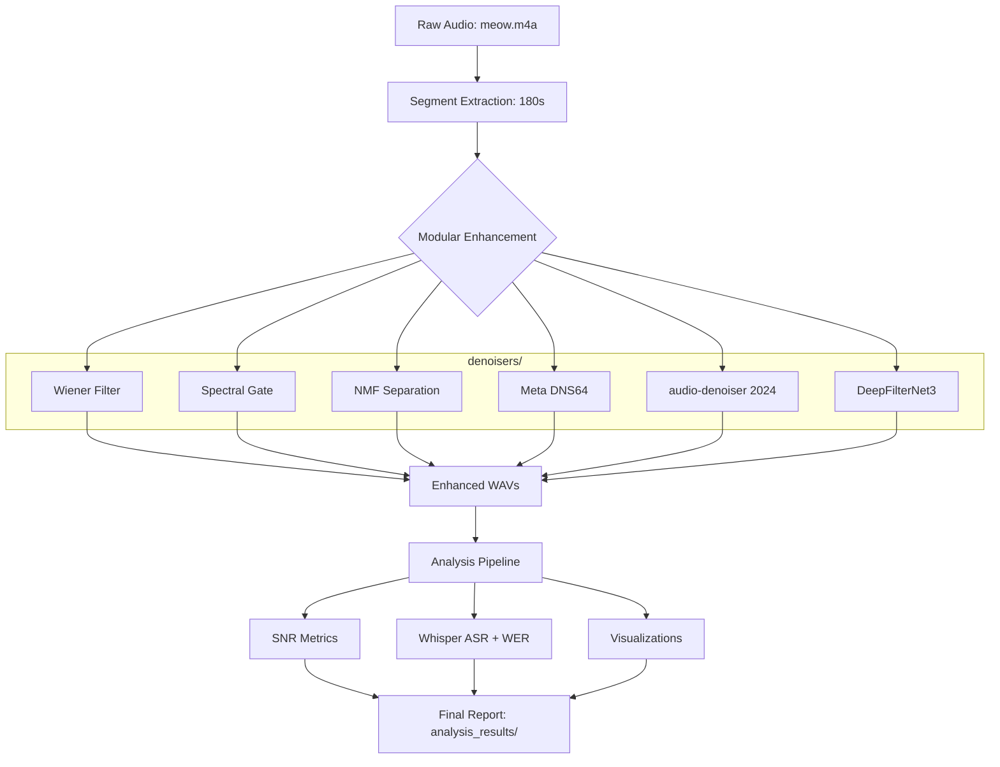
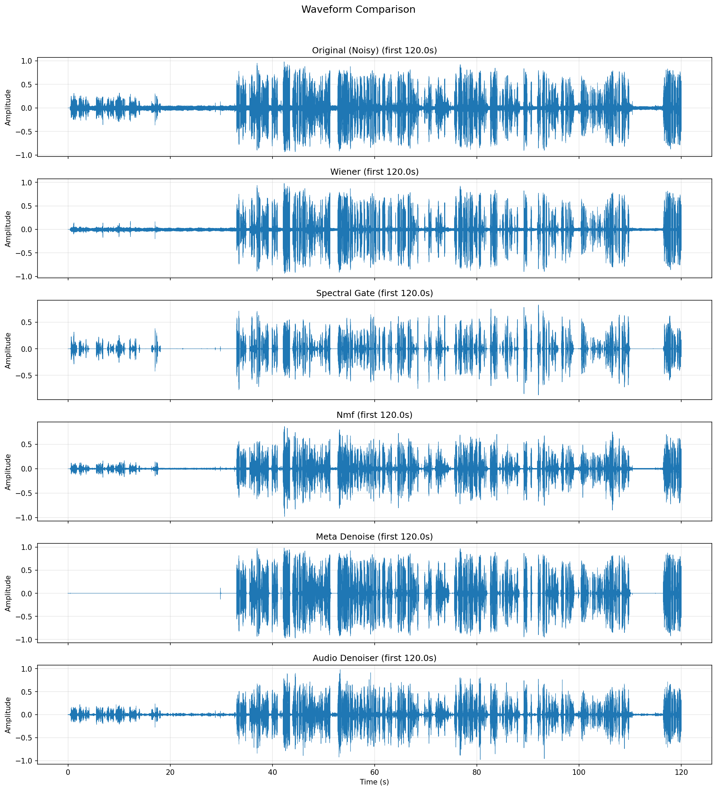

# Team communication processing and analysis in human-factors simulated environment

This project provides a modular, plugin-based pipeline for enhancing and benchmarking noisy historical audio, specifically the **Apollo 13 Flight Director Loop**. It evaluates classical DSP, unsupervised ML, and state-of-the-art AI denoising methods against speech recognition (ASR) performance.

## Overview

The pipeline extracts a segment of audio, applies a battery of denoising "plugins", and performs a comparative analysis using Signal-to-Noise Ratio (SNR) metrics and Whisper ASR Word Error Rate (WER) against ground-truth subtitles.

### System Workflow



---

## Data Resource: Apollo 13 Flight Director Loop

### 1. Database Identification

**Source**: Apollo 13 Flight Director Loop — Mission Control audio during the oxygen tank failure and subsequent crisis response.

**Specific Recording**: The recording captures the White Team shift led by Flight Director Gene Kranz, beginning approximately 8.5 minutes before the accident (from the end of the last TV transmission from Apollo 13) through the critical hours of the emergency response.

**Origin**: Audio sourced from the [NASA Apollo 13 Flight Director Loop recording on YouTube](https://www.youtube.com/watch?v=KWfnY9cRXO4).

**Archive Context**: This recording is part of a larger collection of approximately 7,200 hours of Apollo 13 Mission Control audio, originally recorded on 30-track analog tapes. These tapes were discovered in the National Archives and digitized by NASA's Johnson Space Center in early 2020, with restoration and public access facilitated by the "Apollo in Real Time" project (apolloinrealtime.org).

**File**: `audio.m4a` — ~4858 seconds (~80 minutes) of Flight Director loop audio, resampled to 16 kHz mono for processing.

### 2. How Will This Data Be Used?

This audio serves as the **primary test bed for developing and benchmarking audio enhancement algorithms** aimed at improving team communication clarity. Specifically:

#### Enhancement Development
- **Noise reduction benchmarking**: The recording is processed through multiple denoising algorithms (Wiener filter, spectral gating, NMF-based source separation) to evaluate which methods best improve speech clarity in real-world team communication audio.
- **Parameter tuning**: The diverse noise characteristics allow tuning enhancement parameters across different noise conditions (static noise, cross-talk, equipment hum, voice-operated-exchange clipping).

#### Transcription Improvement
- **ASR baseline**: The noisy original is transcribed using OpenAI Whisper to establish a baseline word recognition quality.
- **Enhancement validation**: Each denoised version is also transcribed to quantitatively measure whether noise reduction translates to improved automatic speech recognition — the key metric for downstream use in team communication analysis.

#### Analysis Pipeline
A 3–5 minute sample is extracted and processed through the full pipeline:
1. **Audio Enhancement** (`audio_enhancement.py`) — Applies denoising methods and saves enhanced audio files
2. **Comparative Analysis** (`audio_analysis.py`) — Computes SNR metrics, generates waveform/spectrogram visualizations, runs Whisper ASR on all versions, and produces a comparison report

### 3. Why Is This Data the Best Option?

#### Authentic Multi-Speaker Team Communication
The Flight Director loop captures **genuine high-stakes team communication** — multiple flight controllers communicating simultaneously across dedicated loops (EECOM, GNC, CAPCOM, Flight Director). This mirrors the multi-speaker, multi-channel nature of modern team communication environments.

#### Representative Noise Characteristics
The recording contains the same categories of noise found in real-world team communication systems:

| Noise Type | Source | Relevance to Modern Teams |
|---|---|---|
| Background hiss/buzz | Analog recording equipment, thermal noise | Comparable to poor microphone quality, HVAC noise |
| Earth-based RF interference | Antenna station noise | Similar to wireless microphone interference |
| Voice-Operated Exchange (VOX) clipping | Squelch circuitry cutting speech onset/offset | Mirrors push-to-talk artifacts in radio/VoIP systems |
| Cross-talk & bleed | Multiple adjacent audio loops | Equivalent to open-office crosstalk, speakerphone echo |
| Ranging tone interference | Shared voice/data channel | Analogous to notification sounds during calls |

#### Publicly Accessible
The recording is freely available through YouTube, NASA archives, and the Internet Archive — no licensing restrictions, institutional access, or data privacy concerns. This makes the work fully reproducible.

#### Prior ASR Benchmarks Exist
The "Apollo in Real Time" project processed 7,200 hours using OpenAI Whisper, generating 2.9 million utterances. This provides a **known difficulty baseline** — the audio is challenging enough that the project acknowledged transcriptions are "imperfect" and plan improvements with future ASR models.

#### Extended Duration for Scale Testing
At ~80 minutes, the recording is long enough to:
- Extract multiple 3–5 minute test samples from different segments (quiet periods, intense crosstalk, equipment noise)
- Test algorithm performance consistency across varying noise conditions
- Validate that enhancement methods don't degrade over time (important for batch processing)

#### Historical & Domain Significance
The Apollo 13 crisis is one of the most documented team communication events in history. Flight Director Gene Kranz's team demonstrated extraordinary communication discipline under extreme pressure. Studying the audio characteristics of this communication provides both technical and domain-relevant insights for communication research.

---

## Enhancement Methods (Plugins)

The system uses a **Plugin Architecture**. Each denoiser lives in `denoisers/` and inherits from `BaseDenoiser`.

| Method | Type | Key | Description |
|---|---|---|---|
| **Wiener Filter** | Classical | `wiener` | Statistical optimal linear filter. |
| **Spectral Gate** | Classical | `spectral_gate` | Non-stationary noise reduction via `noisereduce`. |
| **NMF** | ML | `nmf` | Matrix factorization to isolate speech components. |
| **Meta DNS64** | AI | `meta_denoise` | Real-time waveform denoiser from Facebook Research. |
| **audio-denoiser** | AI | `audio_denoiser` | 2024 transformer-based model (38M parameters). |
| **DeepFilterNet3**| AI | `deepfilter` | High-fidelity deep filtering at 48kHz. |

---

## Benchmarking Results (First 3 Mins)

The following results compare the methods against the original noisy audio (`25.29 dB` baseline SNR).

### 1. SNR Improvement
| Method | Global SNR (dB) | Improvement (dB) | Segmental Improvement (dB) |
|---|---|---|---|
| **Original (Noisy)** | 25.29 | +0.00 | +0.00 |
| **Wiener** | 26.13 | +0.84 | -1.76 |
| **Spectral Gate** | 76.71 | **+51.43** | +11.91 |
| **NMF** | 33.93 | +8.64 | +7.39 |
| **Meta DNS64** | 81.62 | **+56.33** | +11.91 |
| **audio-denoiser** | 31.04 | +5.75 | +5.69 |

### 2. ASR Performance (Whisper `base`)
| Method | Word Count | WER (%) |
|---|---|---|
| **Ground Truth** | ~400 | - |
| **Original (Noisy)**| 408 | **34.09%** |
| **Wiener** | 392 | 48.99% |
| **Spectral Gate** | 387 | 46.72% |
| **Meta Denoise** | 360 | 37.88% |
| **audio-denoiser** | 419 | 36.62% |

> [!NOTE]
> Counter-intuitively, while Meta and Spectral Gate show massive SNR gains, the "Noisy" original still yields the lowest WER. This suggests that aggressive denoising can introduce artifacts that confuse the ASR model more than the original broadband noise.
> Further , it must be realised that due to time constraints, the analysis was performed only on the first 3 minutes of the audio hence these results would change if the entire audio is processed.
---

## Visualizations

### Spectrogram Comparison


### Waveform Comparison


---

## Usage

### 1. Run Modular Enhancement (`audio_enhancement.py`)
This script applies multiple denoising methods to an audio segment and saves the results.

**Basic Usage:**
```bash
# Run all discovered plugins on the default file (meow.m4a)
uv run audio_enhancement.py

# Run only specific AI models
uv run audio_enhancement.py --methods meta_denoise,audio_denoiser
```

**Command-line Arguments (kwargs):**
| Argument | Type | Default | Description |
|---|---|---|---|
| `--input` | `str` | `meow.m4a` | Path to the source audio file. |
| `--start` | `float` | `0.0` | Start offset in seconds. |
| `--duration` | `float` | `180.0` | Duration to process in seconds. |
| `--sr` | `int` | `16000` | Target sample rate for processing. |
| `--output-dir` | `str` | `enhanced_outputs`| Directory to save enhanced WAV files. |
| `--methods` | `str` | `None` | Comma-separated list of method keys (e.g., `wiener,deepfilter`). Runs all if omitted. |

---

### 2. Run Analysis (`audio_analysis.py`)
This script compares original and enhanced audio using SNR metrics, visualizations, and Whisper ASR.

**Basic Usage:**
```bash
# Run analysis with default settings
uv run audio_analysis.py

# Specify a larger Whisper model for better accuracy
uv run audio_analysis.py --whisper-model small
```

**Command-line Arguments (kwargs):**
| Argument | Type | Default | Description |
|---|---|---|---|
| `--input` | `str` | `meow.m4a` | Path to the original source audio. |
| `--enhanced-dir` | `str` | `enhanced_outputs`| Directory containing enhanced `.wav` files. |
| `--vtt-file` | `str` | `meow.en.vtt` | Path to YouTube VTT subtitle file for ground truth. |
| `--output-dir` | `str` | `analysis_results`| Directory to save plots, CSVs, and reports. |
| `--sr` | `int` | `16000` | Sample rate for evaluation. |
| `--start` | `float` | `0.0` | Start offset (should match enhancement script). |
| `--duration` | `float` | `180.0` | Duration (should match enhancement script). |
| `--whisper-model`| `str` | `base` | Whisper model size (`tiny`, `base`, `small`, `medium`, `large`). |

---


## Notebooks

As requested, here are the notebooks that were generated during the development process:

- `01_audio_enhancement_plugin_development.ipynb`: Development of the audio enhancement plugins.
- `02_audio_enhancement_end_to_end_analysis.ipynb`: End-to-end analysis of the audio enhancement system.

## Project Structure
- `audio_enhancement.py`: Orchestrator for the plugin system.
- `audio_analysis.py`: Main benchmarking script (SNR, ASR, Plots).
- `denoisers/`: Directory containing all modular enhancement plugins.
- `analysis_results/`: Generated reports, CSVs, and PNGs.
